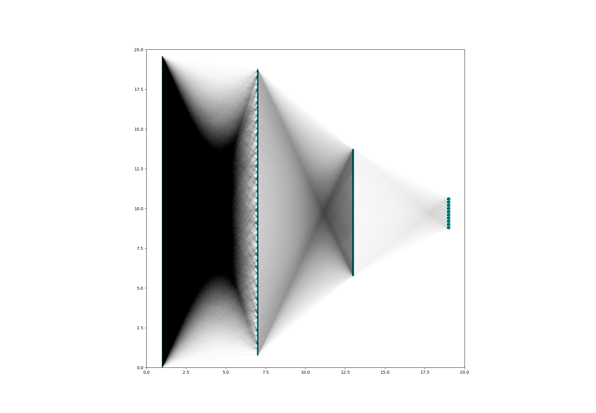
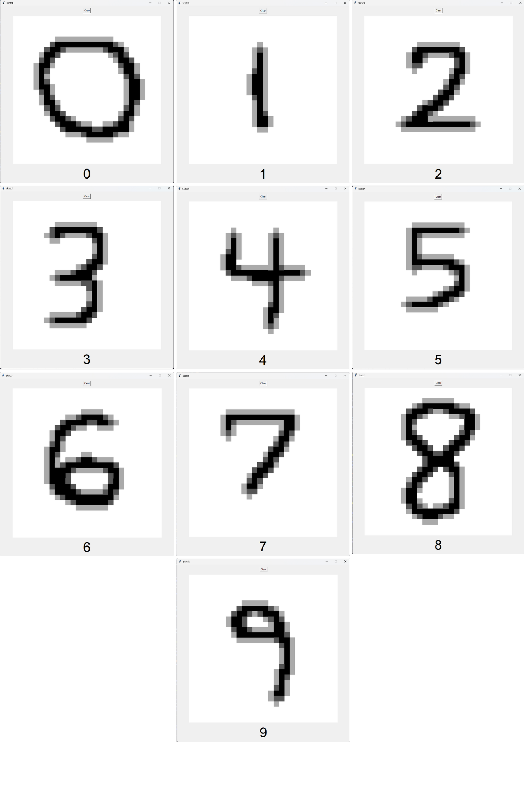

# DL_HelloWorld

A neural network trained on the MNIST dataset with 96% accuracy.

## Use the Interactive Sketchpad Classifier
Run ```python app.py```

## Architecture
>784 Pixels

>240 ReLU

>80 ReLU

>10 SoftMax

## Loss
Cross Entropy (after softmax)

## Optimizer
RMSProp with minibatches

## Network


## Screenshot


## Collage

