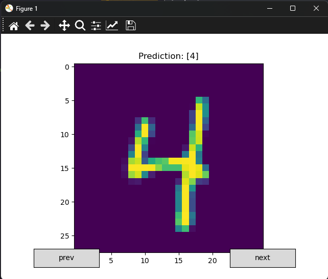

# DL_HelloWorld

A neural network trained on the MNIST dataset with 96% accuracy.

## Architecture
>784 pixels
>240 ReLU
>80 ReLU
>10 SoftMax

## Loss
Difference between the output of the last layer and a 1-hot encoded representation of the expected label.

## Optimizer
Batch Gradient Descent.

## Screenshot

## Network

